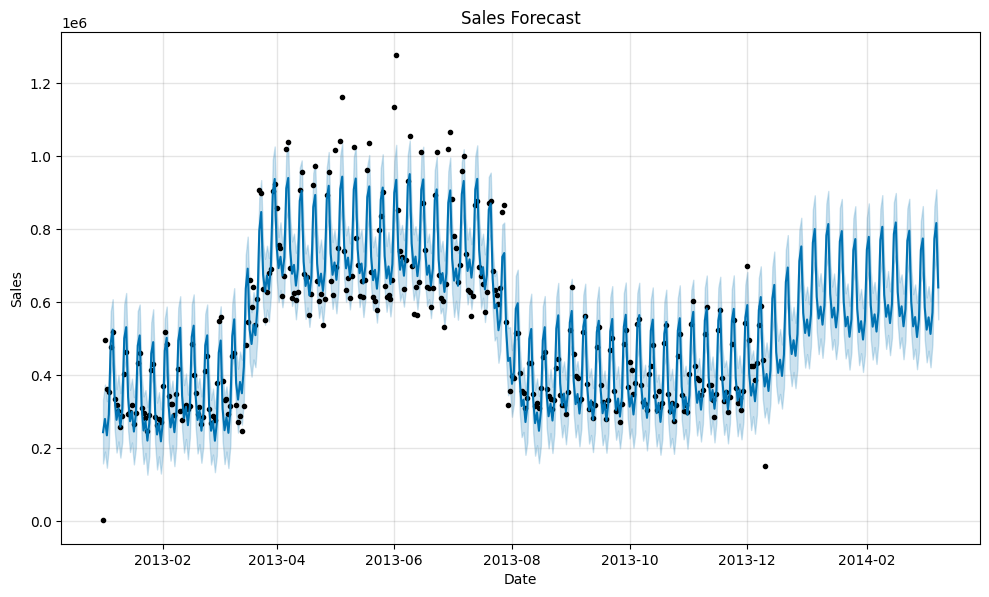
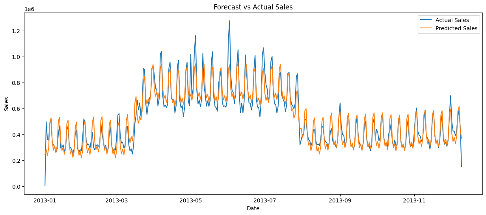
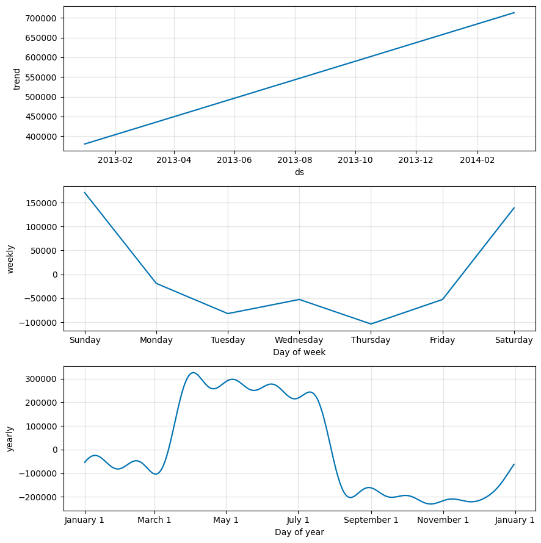

# 📈 Sales Forecasting Using Facebook Prophet

## 📌 Project Overview

This project predicts future retail sales using historical sales data from the Kaggle Store Sales Time Series Forecasting dataset. The Facebook Prophet forecasting model is used to analyze sales trends, seasonality, holiday effects, and promotional impacts to generate accurate future sales forecasts.

The project also evaluates the forecasting performance using Mean Absolute Error (MAE) and Root Mean Squared Error (RMSE).

---

## 🎯 Objectives

- Predict future retail sales using historical time-series data.
- Analyze sales trends and seasonal patterns.
- Include holiday effects in forecasting.
- Include promotional effects using the `onpromotion` feature.
- Compare predicted sales with actual sales.
- Evaluate model accuracy using MAE and RMSE.

---

## 📂 Dataset

**Source:** Kaggle – Store Sales Time Series Forecasting

Files used:

- train.csv
- holidays_events.csv
- transactions.csv

---

## 🛠 Technologies Used

- Python
- Pandas
- NumPy
- Matplotlib
- Prophet (Facebook Prophet)
- Scikit-learn
- Google Colab

---

## ⚙️ Project Workflow

1. Load datasets
2. Data preprocessing
3. Convert dates into datetime format
4. Aggregate daily sales
5. Prepare Prophet dataset
6. Train Prophet forecasting model
7. Add holiday effects
8. Add promotional effects
9. Forecast future sales
10. Evaluate model performance
11. Visualize forecasting results

---

## 🚀 Model Features

- Trend Analysis
- Weekly Seasonality
- Yearly Seasonality
- Holiday Effects
- Promotional Effects
- Future Sales Forecasting
- Forecast vs Actual Comparison

---

## 📊 Evaluation Metrics

The forecasting model was evaluated using:

- Mean Absolute Error (MAE)
- Root Mean Squared Error (RMSE)

These metrics help measure how closely the predicted sales match the actual sales.

---

## 📈 Results

The Prophet model successfully forecasted retail sales for the next 90 days.

The model captured:

- Long-term sales trends
- Weekly seasonality
- Yearly seasonality
- Holiday effects
- Promotional effects

---

## 📁 Project Structure

```text
Sales-Forecasting-Using-Prophet/
│
├── Sales_Forecasting_Prophet.ipynb
├── README.md
├── requirements.txt
└── images/
    ├── forecast.png
    ├── forecast_vs_actual.png
    └── components.png
```

---

## 📷 Project Screenshots

### 📈 Sales Forecast



---

### 📊 Forecast vs Actual Sales



---

### 📉 Trend & Seasonality Components



## 🔮 Future Improvements

- Build an LSTM-based forecasting model.
- Deploy the project using Streamlit.
- Add real-time sales forecasting.
- Include external factors such as weather and economic indicators.

---

## 👩‍💻 Author

**Shruti Singh**

Machine Learning Enthusiast

GitHub: https://github.com/YOUR_GITHUB_USERNAME
